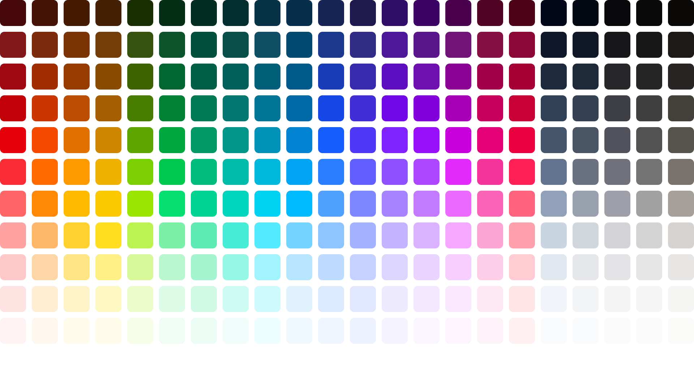

# 🌈 twc – Tailwind Colors for Figma

**twc** is a Figma plugin that adds the complete default [Tailwind CSS](https://tailwindcss.com/docs/colors) color palette as document color variables.

No setup, no copy-pasting — just one click to get a beautifully organized palette inside your Figma file, fully powered by Figma variables.

---

## 🎨 What You Get

- ✅ 22 color families:  
  `red`, `orange`, `amber`, `yellow`, `lime`, `green`, `emerald`, `teal`, `cyan`, `sky`, `blue`, `indigo`, `violet`, `purple`, `fuchsia`, `pink`, `rose`, `slate`, `gray`, `zinc`, `neutral`, `stone`

- ✅ 11 steps per color: `50` → `950`

- ✅ Color variables for each swatch (e.g. `tw-red/500`)

- ✅ Labeled swatches laid out in a clear grid

- ✅ Auto-detects your current page background and adjusts text contrast for label visibility

- ✅ **54 predefined gradient styles** grouped by theme:
  - `Blue & Purple`
  - `Warm`
  - `Cool`
  - `Pastel`
  - `Neutral`
  - `Nature`
  - `Dark`
  - `Multi-color`

- ✅ Each gradient:
  - Uses color variables for stops (e.g. `tw-blue/500`)
  - Supports multi-stop gradients (2–5 colors)
  - Includes directionality (`to-r`, `to-br`, `to-tr`, etc.)
  - Is added as a named Figma **paint style** (e.g. `tw-gradient/bluePurple/ocean wave`)

---

## 🚀 Usage

1. Run the plugin in your Figma file.
2. All Tailwind colors will be added as **document variables**.
3. A swatch grid will be generated, organized by color group and step.
4. A set of **named gradient styles** will be created in your paint styles panel.
5. Use the variables and gradients in fills, strokes, styles, or components as needed.

---

## 🛠 Dev Info

Built with:

- [`colorjs.io`](https://colorjs.io/) for OKLCH → sRGB conversion
- Figma Plugin API
- TypeScript
- esbuild

---

## 📄 License

MIT